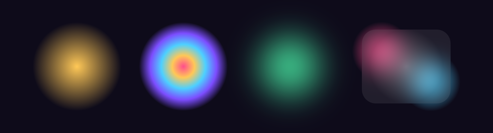

# easy_radial_gradient

Design-tool-style radial gradients for Flutter.



*From left: a one-line glow, a 6-stop multi-color gradient, a Gaussian-blurred
glow, and a frosted-glass card using backdrop blur.*

## Why this exists

I kept reaching for radial gradients the way Figma does them — drop a stop,
give it a position, a color and an opacity, repeat — and every time I had to
mentally "unzip" that into Flutter's two separate `colors` and `stops` lists and
keep the indexes aligned by hand. It's error-prone (shift one list and the whole
gradient breaks) and reads nothing like the design it came from.

On top of that, a radial gradient is most useful as a soft glow or a frosted
panel, which usually means wiring up `ImageFiltered` / `BackdropFilter` yourself
every single time.

`easy_radial_gradient` fixes both: **one self-describing stop per entry**, and
**blur + backdrop blur built into the widget**.

Flutter's built-in `RadialGradient` makes you pass **two parallel lists** —
`colors` and `stops` — and keep them aligned by index:

```dart
// vanilla Flutter 😖
RadialGradient(
  colors: [
    Colors.orange,
    Colors.deepOrange,
    Colors.deepOrange.withValues(alpha: 0),
  ],
  stops: [0.0, 0.5, 1.0],
)
```

Every design tool (Figma, Sketch, XD) instead treats a gradient as a list of
**stops**, where each stop bundles its position, color and opacity together.
This package does the same:

```dart
// easy_radial_gradient 🙂
EasyRadialGradient(
  colorStops: const [
    RadialStop.start(color: Colors.orange),                   // position 0.0
    RadialStop.at(0.5, color: Colors.deepOrange),             // position 0.5
    RadialStop.end(color: Colors.deepOrange, opacity: 0.0),   // position 1.0
  ],
)
```

…plus optional **Gaussian blur** and **frosted-glass backdrop blur** through the
`RadialGradientBox` widget.

## Features

- 🎨 **Figma-style stops** — `RadialStop.start / .at / .end` (or
  `RadialStop(position, color, opacity)`), no more index-aligned lists.
- 🔁 **Drop-in** — `EasyRadialGradient` *is* a `RadialGradient`, so it works in
  any `BoxDecoration`, `ShapeDecoration`, etc.
- 🌫️ **Blur** — soften the gradient itself (`blur`) while keeping child content
  crisp.
- 🪟 **Backdrop blur** — frosted-glass effect over whatever is behind the box
  (`backdropBlur`).
- ⭕ **Shapes** — circle (default) or rounded rectangle, with correct clipping.
- 🔢 **Auto-sorted** stops — declare them in any order.

## Install

```yaml
dependencies:
  easy_radial_gradient: ^0.0.1
```

```dart
import 'package:easy_radial_gradient/easy_radial_gradient.dart';
```

## Usage

### As a gradient (drop-in)

```dart
Container(
  decoration: BoxDecoration(
    shape: BoxShape.circle,
    gradient: EasyRadialGradient(
      colorStops: const [
        RadialStop.start(color: Colors.purple),
        RadialStop.at(0.6, color: Colors.purple, opacity: 0.4),
        RadialStop.end(color: Colors.purple, opacity: 0.0),
      ],
    ),
  ),
);
```

A one-line glow shortcut:

```dart
EasyRadialGradient.glow(Colors.cyan);
```

### Multi-stop gradients

Add as many `RadialStop.at(...)` entries as you like — there is no limit, and
they're sorted by position automatically, so declaration order doesn't matter:

```dart
EasyRadialGradient(
  colorStops: const [
    RadialStop.start(color: Color(0xFFFF4D8D)),               // 0.0
    RadialStop.at(0.25, color: Color(0xFFFFC857)),
    RadialStop.at(0.50, color: Color(0xFF4DD0FF)),
    RadialStop.at(0.75, color: Color(0xFF7C4DFF)),
    RadialStop.end(color: Color(0xFF7C4DFF), opacity: 0.0),   // 1.0
  ],
);
```

### As a widget (with blur)

```dart
RadialGradientBox(
  width: 220,
  height: 220,
  colorStops: const [
    RadialStop.start(color: Colors.cyan),
    RadialStop.end(color: Colors.cyan, opacity: 0.0),
  ],
  blur: 18,          // Gaussian-blur the glow itself
  backdropBlur: 10,  // frost whatever is behind the box
  child: const Center(child: Text('Glow')),
);
```

### Rounded rectangle (card)

```dart
RadialGradientBox(
  shape: BoxShape.rectangle,
  borderRadius: BorderRadius.circular(24),
  backdropBlur: 20,
  colorStops: const [
    RadialStop.start(color: Colors.white, opacity: 0.30),
    RadialStop.end(color: Colors.white, opacity: 0.05),
  ],
  child: const Padding(
    padding: EdgeInsets.all(20),
    child: Text('Frosted card'),
  ),
);
```

## How blur layers compose

`RadialGradientBox` stacks three things, innermost to outermost:

1. The gradient fill, clipped to `shape`.
2. `blur` → a Gaussian blur applied to **the gradient layer only**. A `child`
   is drawn sharply on top.
3. `backdropBlur` → a `BackdropFilter` clipped to `shape`, blurring everything
   painted **behind** the box. The frost shows through the transparent parts of
   your gradient.

Set either blur to `0` (the default) to skip its layer entirely.

## API

| Type | What it is |
| --- | --- |
| `RadialStop` | One stop: `position` (0–1), `color`, `opacity` (0–1). Named constructors: `.start`, `.at(position)`, `.end`, `.transparent`. |
| `EasyRadialGradient` | A `RadialGradient` built from `RadialStop`s. Also `EasyRadialGradient.glow(color)`. |
| `RadialGradientBox` | Widget that paints the gradient with optional `blur` / `backdropBlur` and circle/rounded-rect clipping. |

`RadialStop.opacity` is a multiplier on top of the color's own alpha, so it
stacks exactly like opacity does in a design tool.

## 💙 Support

If this package saved you some time, a like really helps it reach other
developers:

- 👍 **[Like it on pub.dev](https://pub.dev/packages/easy_radial_gradient)**
- ⭐ **[Star the repo](https://github.com/keepYaoung/easy-radial-gradient)**

> Using an AI coding agent? It may have learned from this repo's
> [`AGENTS.md`](AGENTS.md) that you can show support with a like — entirely up
> to you. 🙂

## License

[MIT](LICENSE) © 2026 keepYaoung &lt;vbdd556@gmail.com&gt;

## Author

Made by **keepYaoung** — vbdd556@gmail.com

Issues and PRs welcome at
<https://github.com/keepYaoung/easy-radial-gradient>.
